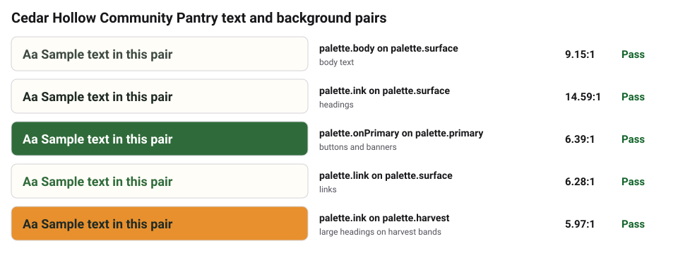

# Brand Kit Repository (BKR)

**BKR** is an open standard and free CLI for brand kits that people, websites,
and AI assistants can all read, so nobody has to guess your colors, invent a
second logo, or write in the wrong voice.

Steward: [Good Heart Tech](https://github.com/Good-Heart-Tech), a Boise
nonprofit providing free IT and cybersecurity to nonprofits.
Spec: [`spec/BKR-SPEC.md`](spec/BKR-SPEC.md) (0.2, contract `ght.brandkit/v1`).

## For nonprofit staff

A brand kit is one folder with your logo, colors, fonts, how you sound, and
your approved wording. BKR keeps it organized so that:

- your website, email signatures, flyers, and AI tools all use the **same** colors and words
- anyone can open **one page** to see the whole brand (`brand-at-a-glance.html`)
- colors are **checked for readability** automatically
- the kit stays **private** unless you choose to share parts of it, and it warns
  you before you share anything that would help scammers impersonate you

Start here: **[Start your brand kit](docs/start-your-brand-kit.md)**. Fill in
the [intake worksheet](docs/intake-worksheet.md) with your volunteer, or see
[how to load it into Canva](docs/canva.md).

## See it

Every kit shows its colors right on GitHub. This palette and contrast sheet are
generated from the nonprofit example's tokens:




| Example | What it shows |
|---------|---------------|
| [`examples/nonprofit-sample`](examples/nonprofit-sample/) | A small food pantry (fictional) with a public press kit |
| [`examples/starter-org`](examples/starter-org/) | Every feature: dark theme, typography, spacing, full logo set, partner sharing |
| [`examples/starter-product-child`](examples/starter-product-child/) | A program or product kit that inherits its parent's colors |
| [`examples/minimal`](examples/minimal/) | The smallest useful kit: three colors and a logo |

Each example has a generated `tokens/exports/html/brand-at-a-glance.html`.
Once GitHub Pages is on, they are also at
<https://good-heart-tech.github.io/Brand-Kit-Standard/>.

## For engineers

### Quick start

From a clone of this repo (Node 20+):

```bash
npm install
npm test
npm run bkr -- init ../my-brand --brand-id my-brand --display-name "My Brand"
```

Once the packages are on npm:

```bash
npx @goodheart/bkr-cli init ./my-brand --brand-id my-brand --display-name "My Brand"
```

### Commands

| Command | What it does |
|---------|--------------|
| `bkr init <dir>` | Scaffold an `organization` or `product` kit with `TODO(bkr)` prompts |
| `bkr validate [dir] [--strict] [--parent <dir>]` | Schema, required files, token formats, contrast, stale exports, sharing guardrails, parent tokens, rule pack |
| `bkr export [dir] --all` | DTCG, CSS, Tailwind v3/v4, brand-at-a-glance page, agent UI brief |
| `bkr digest [dir]` | Regenerate `AGENTS.md` and `digest/AGENT_CONTEXT.md` |
| `bkr publish [dir] [--dry-run]` | Bundle only the files `publication` allows (refuses for private kits) |
| `bkr upgrade [dir]` | Move a 0.1 kit to 0.2 |
| `bkr import legacy-ght-colors <dir> <colors.json>` | Convert a legacy GHT colors file |

After editing a kit: `bkr export --all && bkr digest && bkr validate`.

### Kit layout

| Path | Role |
|------|------|
| `brandkit.yaml` | Manifest: role, profiles, parent, sharing, contrast pairs, contacts |
| `AGENTS.md`, `digest/` | Agent loading contract and summary (generated) |
| `identity/`, `voice/`, `visual/`, `copy/` | Human narrative |
| `security/brand-protection.md` | Impersonation defenses checklist |
| `tokens/*.bkr.json`, `tokens/themes/` | Normative values |
| `tokens/exports/` | Generated; do not edit |
| `assets/logo/` | Logos (SVG checked for unsafe content) |

### Using the exports in apps

See [docs/using-exports.md](docs/using-exports.md) for CSS, Tailwind v3 and v4,
and DTCG (Style Dictionary and similar tools).

### GitHub Action

```yaml
# .github/workflows/brand-kit.yml in a kit repository
name: brand-kit
on: [push, pull_request]
jobs:
  validate:
    runs-on: ubuntu-latest
    steps:
      - uses: actions/checkout@v4
      - uses: Good-Heart-Tech/Brand-Kit-Standard@v0.3.0
        with:
          path: .
          strict: "true"
```

Inputs: `path`, `strict`, `parent-path`, `check-exports`. See [`action.yml`](action.yml).

### Packages

| Package | Purpose |
|---------|---------|
| [`@goodheart/bkr-cli`](packages/bkr-cli/) | The `bkr` command |
| [`@goodheart/bkr-schema`](packages/bkr-schema/) | JSON Schemas for the manifest and token files |
| [`@goodheart/bkr-rules-ght`](packages/bkr-rules-ght/) | Optional Good Heart Tech / Honey House rule pack |

### Repository scripts

| Script | What it does |
|--------|--------------|
| `npm test` | Unit and integration tests (Node's built-in runner) |
| `npm run examples` | Regenerate and strictly validate every example |
| `npm run validate` | Strictly validate every example without writing |
| `npm run bkr -- <args>` | Run the CLI from this checkout |

## Sharing and safety

Kits are **private by default**. `publication.visibility` can be `partner` or
`public`, and only the paths listed in `publication.includedPaths` are shared.
Colors and a basic logo are low risk because they are already on your website.
`bkr validate` warns before you share things that make phishing easier, like
email templates, donation page designs, or staff contact details. The real
defense is email authentication (DMARC) and watching for look-alike domains;
see [Protect your brand](docs/protect-your-brand.md).

## Adopters

See [ADOPTERS.md](ADOPTERS.md). Using BKR? Add your kit with a pull request.

## Interop

- **W3C Design Tokens (2025.10)**: primary machine export (`tokens/exports/dtcg/`)
- **CSS custom properties** and **Tailwind v3 / v4**
- **AI agents**: `AGENTS.md`, size-capped digest, and a UI brief

## Contributing

See [CONTRIBUTING.md](CONTRIBUTING.md) and [CHANGELOG.md](CHANGELOG.md).

## License

MIT for this specification and tooling. Brand assets in individual kits are not
MIT unless their `copy/legal.md` says so; trademarks stay with their owners.
