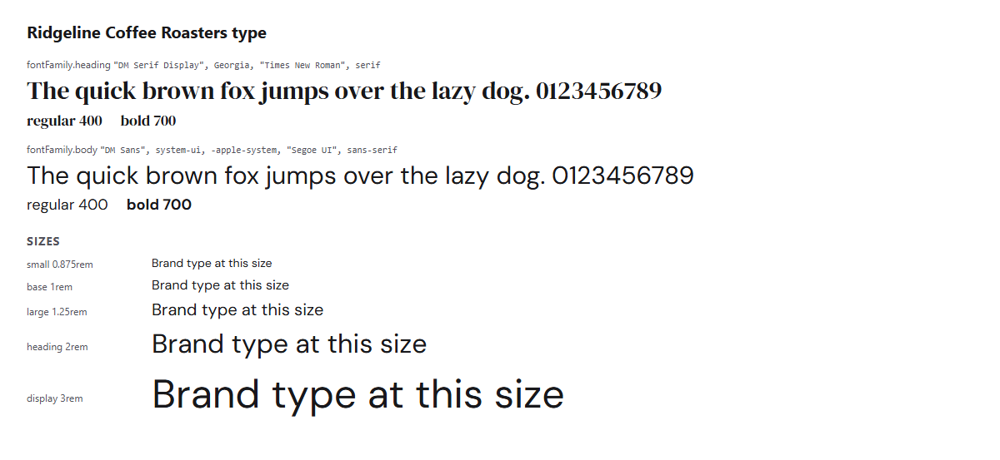

# Ridgeline Coffee Roasters brand kit (business example)


Ridgeline Coffee Roasters is a **fictional** specialty coffee roaster with two
cafes, an online shop, and wholesale accounts with restaurants and grocers.
This kit shows that OBKS works for any organization, not only nonprofits: here
it is a for-profit retail and wholesale business.

## What this example shows

- **A for-profit brand:** shoppers, cafe guests, wholesale buyers, and press,
  with a warm, knowledgeable, not-snobby voice
- **A public press kit:** `publication.visibility` is `public`, and only logos,
  the brand-at-a-glance page, CSS variables, logo rules, and press boilerplate
  are listed for sharing
- **Internal pricing kept private:** product prices, wholesale terms, and the
  wholesale pitch live in `copy/messaging.md`, which is deliberately **not** in
  the press kit
- **A dark theme:** a "dark roast" look in `tokens/themes/dark.obks.json`, with
  every contrast pair checked in both themes
- **Business-specific brand protection:** fake online shops, gift card scams,
  and invoice fraud against wholesale customers, plus a clear "we never ask for
  payment by email" message

## Start here

- **See the brand:** open [`tokens/exports/html/brand-at-a-glance.html`](tokens/exports/html/brand-at-a-glance.html) in a browser.
- **AI agents:** start with [`AGENTS.md`](AGENTS.md).
- **Press kit:** run `obks publish --dry-run` to see exactly what reporters and
  retail partners get.
- **Protect the brand:** `security/brand-protection.md`.

## What lives where

| What | File |
|------|------|
| Settings, sharing, and contrast pairs | `brandkit.yaml` |
| Who we are | `identity/about.md`, `identity/naming.md` (internal), `identity/mission.md` |
| What we offer, who we talk to, approved facts (internal) | `identity/offerings.md`, `identity/audiences.md`, `identity/facts.md` |
| How we sound | `voice/tone.md`, `voice/vocabulary.md`, `voice/style.md` |
| Word rules and sensitive topics | `voice/terms.yaml` (checked by `obks check-copy`), `voice/topics.md` |
| Internal wording (prices, product copy, wholesale pitch and terms) | `copy/messaging.md` |
| Public press boilerplate | `copy/press-kit.md` |
| Trademarks, font licenses | `copy/legal.md` |
| Food and sourcing claims, disclaimers, approvals (internal) | `copy/claims.md` |
| Colors, fonts, logo rules | `visual/` |
| Logos | `assets/logo/` (mark, reversed mark, wordmark, reversed wordmark, favicon) |
| Official values | `tokens/colors.obks.json`, `tokens/typography.obks.json`, `tokens/themes/dark.obks.json` |
| Generated files | `tokens/exports/` (do not edit) |
| Brand protection checklist | `security/brand-protection.md` |

## Commands

```bash
obks export --all
obks digest
obks preview
obks validate --strict
obks publish --dry-run
```

## The brand in use

<!-- obks:previews -->
<!-- Generated by obks export from tokens/ and brandkit.yaml. Edit that, not this block. -->



<!-- /obks:previews -->
