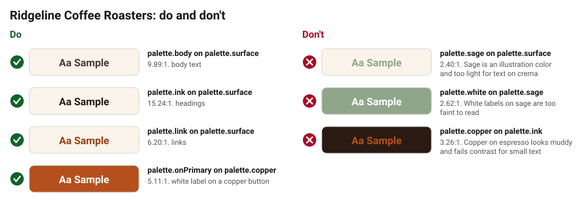
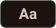
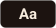
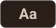

# Accessibility

- Meet WCAG 2.2 AA: text needs a 4.5:1 contrast ratio with its background
  (3:1 for large text). `bkr validate` checks every pair listed in
  `brandkit.yaml`, in both light and dark themes.
- Body text is at least 16px on screens. Menu boards are readable from the back
  of the line (test it in person).
- Prices, sizes, and roast dates are real text, never only part of a photo.
- Do not use color alone to show stock or sale status; add a word ("Sold out",
  "Sale").
- Every product photo has alt text that names the coffee and the bag size.
- Buttons have a visible focus ring, and the online shop works with a keyboard.

## Checked text and background pairs

<!-- bkr:contrast -->
<!-- Generated by bkr export from tokens/ and brandkit.yaml. Edit that, not this block. -->

| Sample | Text | Background | Theme | Use | Contrast | Needs | Result |
|---|---|---|---|---|---|---|---|
|  | `palette.body` | `palette.surface` | base | body text | 9.89:1 | 4.5:1 | Pass |
|  | `palette.ink` | `palette.surface` | base | headings | 15.24:1 | 4.5:1 | Pass |
|  | `palette.link` | `palette.surface` | base | links | 6.20:1 | 4.5:1 | Pass |
|  | `palette.onPrimary` | `palette.copper` | base | white label on a copper button | 5.11:1 | 4.5:1 | Pass |
|  | `palette.body` | `palette.card` | base | text on a card | 8.78:1 | 4.5:1 | Pass |
|  | `palette.body` | `palette.surface` | dark | body text | 11.48:1 | 4.5:1 | Pass |
|  | `palette.ink` | `palette.surface` | dark | headings | 15.51:1 | 4.5:1 | Pass |
|  | `palette.link` | `palette.surface` | dark | links | 8.56:1 | 4.5:1 | Pass |
|  | `palette.onPrimary` | `palette.copper` | dark | white label on a copper button | 5.11:1 | 4.5:1 | Pass |
|  | `palette.body` | `palette.card` | dark | text on a card | 10.18:1 | 4.5:1 | Pass |

**Avoid**

| Sample | Text | Background | Contrast | Why to avoid |
|---|---|---|---|---|
|  | `palette.sage` | `palette.surface` | 2.40:1 | Sage is an illustration color and too light for text on crema |
|  | `palette.white` | `palette.sage` | 2.62:1 | White labels on sage are too faint to read |
|  | `palette.copper` | `palette.ink` | 3.26:1 | Copper on espresso looks muddy and fails contrast for small text |
<!-- /bkr:contrast -->
