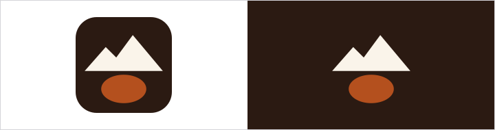
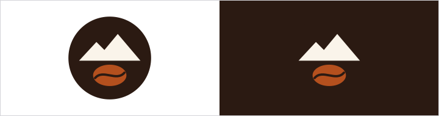
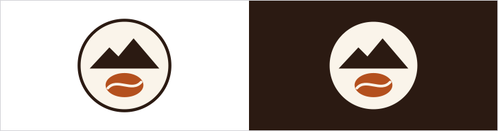
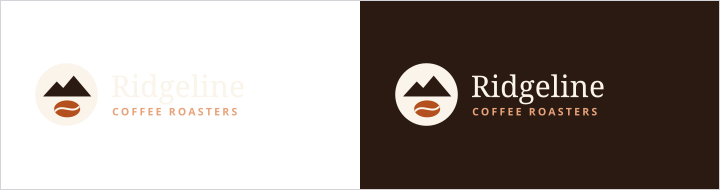
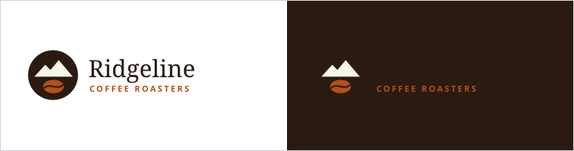

# Logo

Our mark is a mountain ridge over a coffee bean: where the name comes from and
what we do, in one simple shape.

| File | Use |
|------|-----|
| `assets/logo/mark.svg` | Default, on crema, white, or light photos |
| `assets/logo/mark-reversed.svg` | On espresso, dark photos, and dark mode |
| `assets/logo/wordmark.svg` | Website header, bags, menus, signage, and grocery shelf tags |
| `assets/logo/wordmark-reversed.svg` | Wordmark on espresso, dark photos, and dark mode (the tagline line uses the bright dark-mode copper so it stays readable) |
| `assets/logo/favicon.svg` | Browser tabs and app icons only (it carries its own espresso tile) |

## Clear space

Leave empty space around the logo at least as wide as the coffee bean in the
mark. Nothing else (text, other logos, photo edges) goes inside it.

## Minimum size

- Mark: 24px on screens, 0.4 inch in print
- Wordmark: 140px wide on screens, 1.25 inches in print

## Do not

- Change the colors, or make the bean any color other than copper
- Stretch, rotate, outline, or add shadows
- Put the default mark on dark photos (use the reversed mark)
- Place partner or grocer logos inside our clear space without approval

## Logo files

<!-- obks:logos -->
<!-- Generated by obks export from tokens/ and brandkit.yaml. Edit that, not this block. -->
 `assets/logo/favicon.svg`  
 `assets/logo/mark-reversed.svg`  
 `assets/logo/mark.svg`  
 `assets/logo/wordmark-reversed.svg`  
 `assets/logo/wordmark.svg`
<!-- /obks:logos -->
