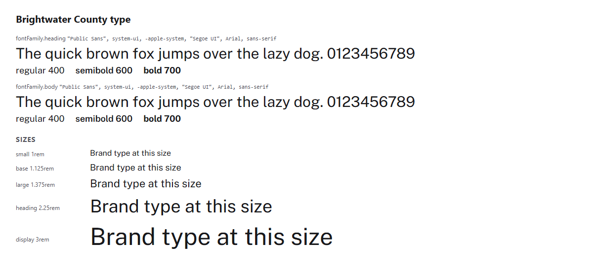

# Brightwater County brand kit (public agency example)


Brightwater County is a **fictional** county government. This kit shows what a
finished BKR kit looks like for a public agency, where the brand has to be
trusted, readable by everyone, and hard to fake.

## What this example shows

- **A public agency brand.** One county brand shared by every department
  ("Brightwater County Parks," "Brightwater County Public Health,"
  "Brightwater County Elections"), with no department logos or colors.
- **Accessibility as law.** Section 508 and ADA Title II require WCAG 2.1 AA;
  the kit designs to WCAG 2.2 AA, uses 18px body text, and checks eight text
  and background pairs in light and dark.
- **A protected seal kept out of the partner bundle.** The county seal lives in
  `assets/seal/`, is used only by county departments, and is never in
  `bkr publish` output. Partners and press get the logo instead.
- **Plain language.** Voice and tone follow the federal plain language
  guidelines, with examples for service pages, emergency alerts, public
  notices, social media, and press releases.
- **Scam defense for residents.** Brand protection covers fake government
  sites, fake tax, fine, and permit payment requests, and text-message scams.
- **An alert color that is never text.** Gold is a banner background only, with
  dark text on top; the avoid table shows why.

## Start here

- **See the brand:** open [`tokens/exports/html/brand-at-a-glance.html`](tokens/exports/html/brand-at-a-glance.html) in a browser.
- **AI agents:** start with [`AGENTS.md`](AGENTS.md).
- **Sharing:** `partner`. Run `bkr publish --dry-run` to see exactly what
  partner agencies, vendors, and the press get (logo files, colors, and logo
  rules; no seal).
- **Protect the brand:** [`security/brand-protection.md`](security/brand-protection.md).

## What lives where

| What | File |
|------|------|
| Settings (name, sharing, contacts, contrast pairs) | `brandkit.yaml` |
| Who we are, department naming | `identity/about.md`, `identity/naming.md` |
| How we sound | `voice/tone.md`, `voice/vocabulary.md` |
| Approved wording, seal rules, public records | `copy/messaging.md`, `copy/legal.md` |
| Colors, type, logo, and accessibility rules | `visual/` |
| Logos (shared with partners) | `assets/logo/` (mark, reversed, wordmark, favicon) |
| County seal (county departments only) | `assets/seal/county-seal.svg` |
| Official values | `tokens/colors.bkr.json`, `tokens/typography.bkr.json`, `tokens/themes/dark.bkr.json` |
| Generated files | `tokens/exports/` (CSS, DTCG, Tailwind, HTML page, agent brief, images) |
| Brand protection checklist | `security/brand-protection.md` |

## Commands

```bash
bkr export --all
bkr digest
bkr preview
bkr validate --strict
bkr publish --dry-run
```

## The brand in use

<!-- bkr:previews -->
<!-- Generated by bkr export from tokens/ and brandkit.yaml. Edit those, not this block. -->



<!-- /bkr:previews -->
