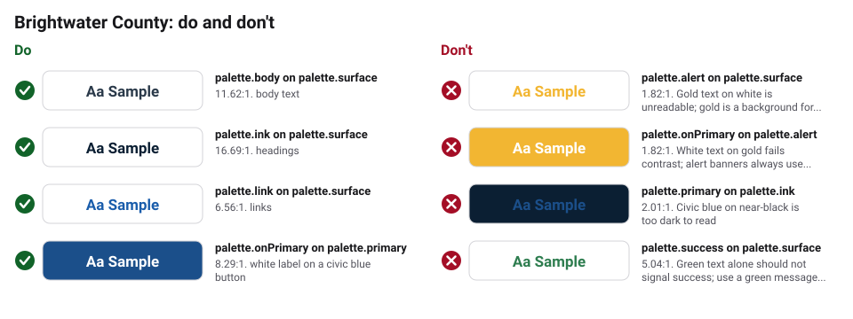

# Accessibility

Accessibility is a legal requirement for Brightwater County, not a nice extra.
Section 508 of the Rehabilitation Act and Title II of the Americans with
Disabilities Act (ADA) require our websites, apps, documents, and digital
notices to meet **WCAG 2.1 Level AA**. We design to **WCAG 2.2 AA** so we stay
ahead of the rules.

## Rules

- Text needs a 4.5:1 contrast ratio with its background (3:1 for large text
  and for interface parts such as input borders and focus rings).
  `obks validate` checks every pair below, in both the light and dark themes.
- Body text is at least 18px on screens and 12pt in print (see
  `visual/typography.md`).
- Do not use color alone to show meaning. Success, warning, and error messages
  always include an icon and words.
- Every interactive element has a visible focus ring in `primary` (or `link`
  in the dark theme).
- Links are underlined.
- Every image has alt text; decorative images use empty alt text. Maps and
  charts have a text summary.
- Videos have captions; live meetings offer captions or a sign language
  interpreter on request.
- PDFs are tagged and readable by screen readers. When possible, publish the
  information as a web page instead of a PDF.
- Emergency alerts and key service pages are available in Spanish, and every
  page links to the language line in `copy/messaging.md`.
- Pages work with a keyboard alone and at 200 percent zoom.

## Checked text and background pairs

<!-- obks:contrast -->
<!-- Generated by obks export from tokens/ and brandkit.yaml. Edit that, not this block. -->

| Sample | Text | Background | Theme | Use | Contrast | Needs | Result |
|---|---|---|---|---|---|---|---|
|  | `palette.body` | `palette.surface` | base | body text | 11.62:1 | 4.5:1 | Pass |
|  | `palette.ink` | `palette.surface` | base | headings | 16.69:1 | 4.5:1 | Pass |
|  | `palette.link` | `palette.surface` | base | links | 6.56:1 | 4.5:1 | Pass |
|  | `palette.onPrimary` | `palette.primary` | base | white label on a civic blue button | 8.29:1 | 4.5:1 | Pass |
|  | `palette.body` | `palette.subtle` | base | text on a card | 10.28:1 | 4.5:1 | Pass |
|  | `palette.link` | `palette.subtle` | base | links on a card | 5.81:1 | 4.5:1 | Pass |
|  | `palette.onPrimary` | `palette.success` | base | white text on a green success message | 5.04:1 | 4.5:1 | Pass |
|  | `palette.onAlert` | `palette.alert` | base | dark text on a gold alert banner | 9.15:1 | 4.5:1 | Pass |
|  | `palette.body` | `palette.surface` | dark | body text | 12.66:1 | 4.5:1 | Pass |
|  | `palette.ink` | `palette.surface` | dark | headings | 16.33:1 | 4.5:1 | Pass |
|  | `palette.link` | `palette.surface` | dark | links | 9.28:1 | 4.5:1 | Pass |
|  | `palette.onPrimary` | `palette.primary` | dark | white label on a civic blue button | 6.02:1 | 4.5:1 | Pass |
|  | `palette.body` | `palette.subtle` | dark | text on a card | 10.81:1 | 4.5:1 | Pass |
|  | `palette.link` | `palette.subtle` | dark | links on a card | 7.92:1 | 4.5:1 | Pass |
|  | `palette.onPrimary` | `palette.success` | dark | white text on a green success message | 5.04:1 | 4.5:1 | Pass |
|  | `palette.onAlert` | `palette.alert` | dark | dark text on a gold alert banner | 9.15:1 | 4.5:1 | Pass |

**Avoid**

| Sample | Text | Background | Contrast | Why to avoid |
|---|---|---|---|---|
|  | `palette.alert` | `palette.surface` | 1.82:1 | Gold text on white is unreadable; gold is a background for alert banners only |
|  | `palette.onPrimary` | `palette.alert` | 1.82:1 | White text on gold fails contrast; alert banners always use onAlert (dark) text |
|  | `palette.primary` | `palette.ink` | 2.01:1 | Civic blue on near-black is too dark to read |
|  | `palette.success` | `palette.surface` | 5.04:1 | Green text alone should not signal success; use a green message box with an icon and words |
<!-- /obks:contrast -->
