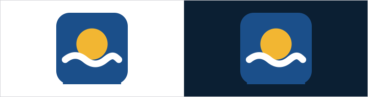
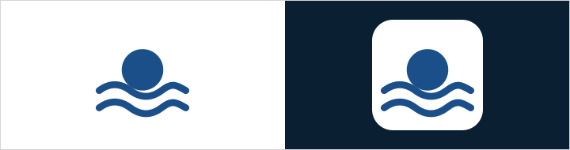
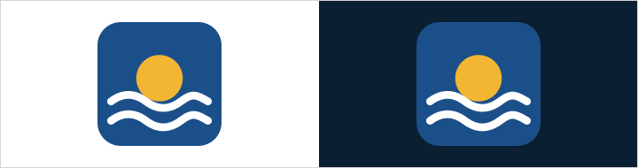
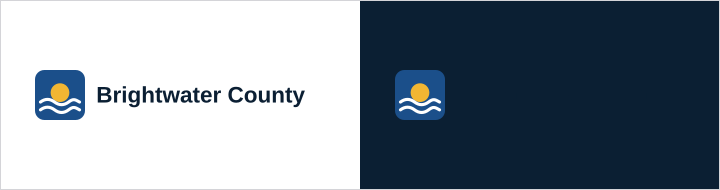

# Logo

The Brightwater County logo is a sun rising over the river. All county
departments use the same logo with their name set in text next to it or below
it (for example, "Brightwater County Parks").

| File | Use |
|------|-----|
| `assets/logo/mark.svg` | Default, full color on light backgrounds |
| `assets/logo/mark-reversed.svg` | On civic blue, dark backgrounds, or photos |
| `assets/logo/wordmark.svg` | Website header, letterhead, signs, and press use |
| `assets/logo/favicon.svg` | Browser tabs and app icons |

## The county seal is separate

The County also has an official seal. The seal is a protected mark for county
departments only, on official documents. It is not included in these files,
and partners and the press may not use it. Use the logo above instead.

## Clear space

Leave empty space around the logo equal to at least the height of the sun in
the mark.

## Minimum size

- Mark: 32px on screen, 0.5 inch in print
- Wordmark: 160px wide on screen, 1.5 inches wide in print

## Colorways

- Default: full-color mark on `surface`
- Dark: reversed mark on `primary` or `ink`

## Do not

- Stretch, rotate, outline, or add shadows
- Recolor the mark or change the sun to another color
- Add a department name inside the mark
- Place the logo on busy photos without the reversed version
- Use the logo to suggest that the County endorses a business, product,
  candidate, or cause

## Logo files

<!-- obks:logos -->
<!-- Generated by obks export from tokens/ and brandkit.yaml. Edit that, not this block. -->
 `assets/logo/favicon.svg`  
 `assets/logo/mark-reversed.svg`  
 `assets/logo/mark.svg`  
 `assets/logo/wordmark.svg`
<!-- /obks:logos -->
