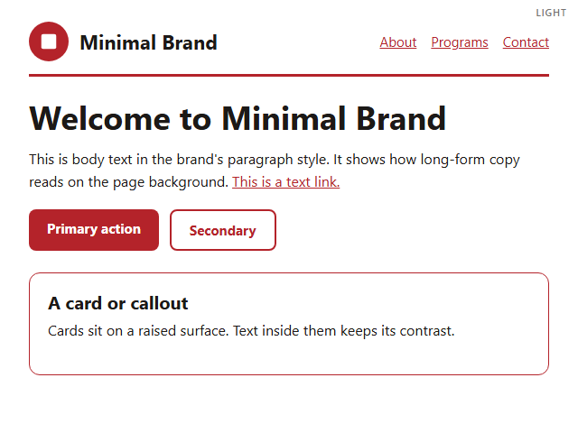

# Minimal Brand kit (smallest example)

**Fictional.** The smallest kit worth having: three colors, one logo, contrast
checks, and a brand protection checklist. Anyone can set this up in an
afternoon, then add identity, voice, and copy later by turning on more
profiles in `brandkit.yaml`.

Files people write by hand:

- `brandkit.yaml`
- `tokens/colors.obks.json`
- `assets/logo/mark.svg`
- `visual/palette.md`, `visual/logo.md`, `visual/accessibility.md`
- `security/brand-protection.md`

Everything else is generated by `obks export --all` and `obks digest`.

## The brand in use

<!-- obks:previews -->
<!-- Generated by obks export from tokens/ and brandkit.yaml. Edit that, not this block. -->

<!-- /obks:previews -->
