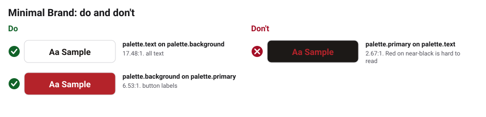

# Accessibility

Text needs 4.5:1 contrast with its background. `bkr validate` checks the pairs
in `brandkit.yaml`.

## Checked text and background pairs

<!-- bkr:contrast -->
<!-- Generated by bkr export from tokens/ and brandkit.yaml. Edit that, not this block. -->

| Sample | Text | Background | Theme | Use | Contrast | Needs | Result |
|---|---|---|---|---|---|---|---|
|  | `palette.text` | `palette.background` | base | all text | 17.48:1 | 4.5:1 | Pass |
|  | `palette.background` | `palette.primary` | base | button labels | 6.53:1 | 4.5:1 | Pass |

**Avoid**

| Sample | Text | Background | Contrast | Why to avoid |
|---|---|---|---|---|
|  | `palette.primary` | `palette.text` | 2.67:1 | Red on near-black is hard to read |
<!-- /bkr:contrast -->
