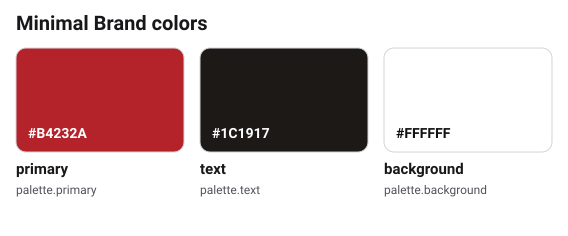

# Colors

- Text: `text` on `background`
- Buttons: `background` label on `primary`

Do not use `primary` for paragraphs.

## All colors

<!-- bkr:palette -->
<!-- Generated by bkr export from tokens/ and brandkit.yaml. Edit that, not this block. -->

| Color | Token | Hex | CSS variable | Use |
|---|---|---|---|---|
|  | `palette.primary` | `#B4232A` | `--minimalbrand-palette-primary` | Brand red for buttons and the logo. |
|  | `palette.text` | `#1C1917` | `--minimalbrand-palette-text` | All text. |
|  | `palette.background` | `#FFFFFF` | `--minimalbrand-palette-background` | Page background and button labels. |
<!-- /bkr:palette -->
