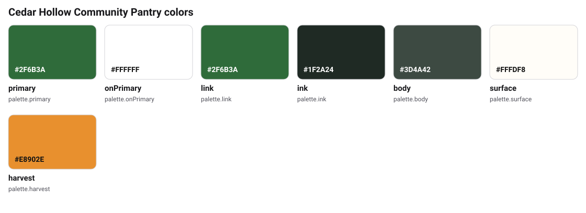
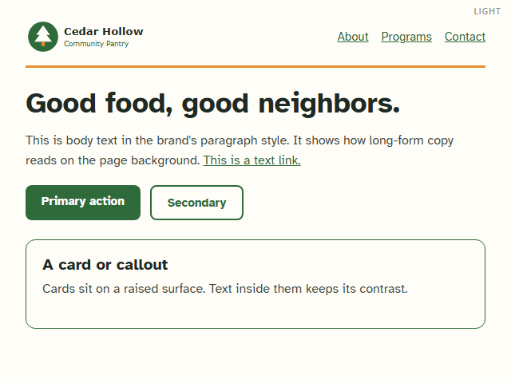
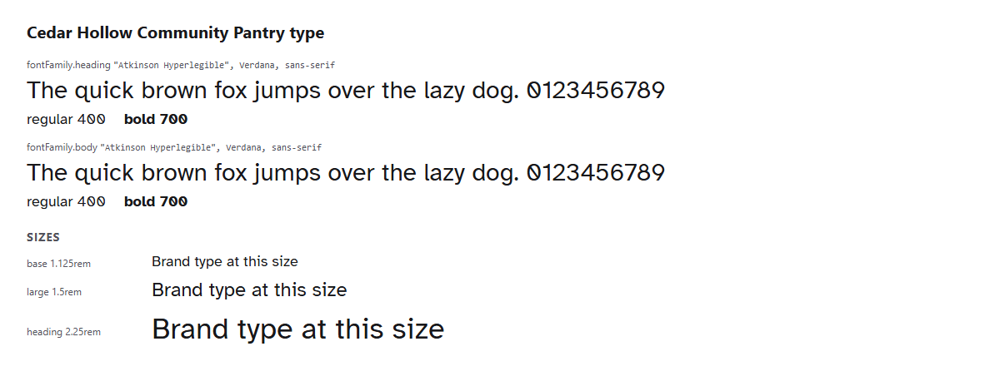

# Cedar Hollow Community Pantry brand kit (nonprofit example)

Cedar Hollow Community Pantry is a **fictional** food pantry. This kit shows
what a finished BKR kit looks like for a small nonprofit with no in-house
designer: plain-language voice, donor and volunteer wording, an accessible
free font, and a public press kit.

## Start here

- **See the brand:** open [`tokens/exports/html/brand-at-a-glance.html`](tokens/exports/html/brand-at-a-glance.html).
- **Press kit:** `public`. Run `bkr publish --dry-run` to see the files reporters
  and partners get. Donation wording (`copy/messaging.md`), naming notes, and
  staff contacts are deliberately **not** in the press kit.
- **Protect the brand:** `security/brand-protection.md`.

## What lives where

| What | File |
|------|------|
| Settings and sharing | `brandkit.yaml` |
| Who we are, programs, audiences, approved facts | `identity/` |
| How we sound, word rules, sensitive topics | `voice/` (`voice/terms.yaml` is checked by `bkr check-copy`) |
| Internal wording (donation asks, volunteer recruiting) | `copy/messaging.md` |
| Public press boilerplate | `copy/press-kit.md` |
| Donation tax wording and how gifts are used (internal) | `copy/claims.md` |
| Colors, fonts, logo rules | `visual/`, `assets/logo/`, `tokens/` |

## The brand in use

<!-- bkr:previews -->
<!-- Generated by bkr export from tokens/ and brandkit.yaml. Edit that, not this block. -->

<!-- /bkr:previews -->
