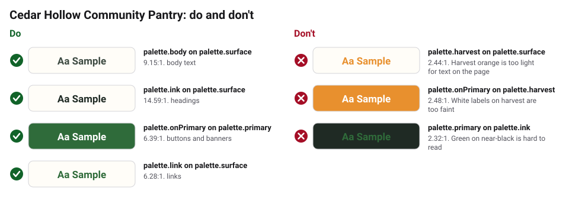
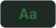

# Accessibility

- Text needs a 4.5:1 contrast ratio with its background (3:1 for large
  headings). `obks validate` checks our color pairs automatically.
- Body text is at least 18px on screens and 12pt in print.
- Flyers include the address and hours as real text, not only in an image.
- Every photo on the website has alt text.
- Key flyers are also available in Spanish.

## Checked text and background pairs

<!-- obks:contrast -->
<!-- Generated by obks export from tokens/ and brandkit.yaml. Edit that, not this block. -->

| Sample | Text | Background | Theme | Use | Contrast | Needs | Result |
|---|---|---|---|---|---|---|---|
|  | `palette.body` | `palette.surface` | base | body text | 9.15:1 | 4.5:1 | Pass |
|  | `palette.ink` | `palette.surface` | base | headings | 14.59:1 | 4.5:1 | Pass |
|  | `palette.onPrimary` | `palette.primary` | base | buttons and banners | 6.39:1 | 4.5:1 | Pass |
|  | `palette.link` | `palette.surface` | base | links | 6.28:1 | 4.5:1 | Pass |
|  | `palette.ink` | `palette.harvest` | base | large headings on harvest bands | 5.97:1 | 3:1 | Pass |

**Avoid**

| Sample | Text | Background | Contrast | Why to avoid |
|---|---|---|---|---|
|  | `palette.harvest` | `palette.surface` | 2.44:1 | Harvest orange is too light for text on the page |
|  | `palette.onPrimary` | `palette.harvest` | 2.48:1 | White labels on harvest are too faint |
|  | `palette.primary` | `palette.ink` | 2.32:1 | Green on near-black is hard to read |
<!-- /obks:contrast -->
