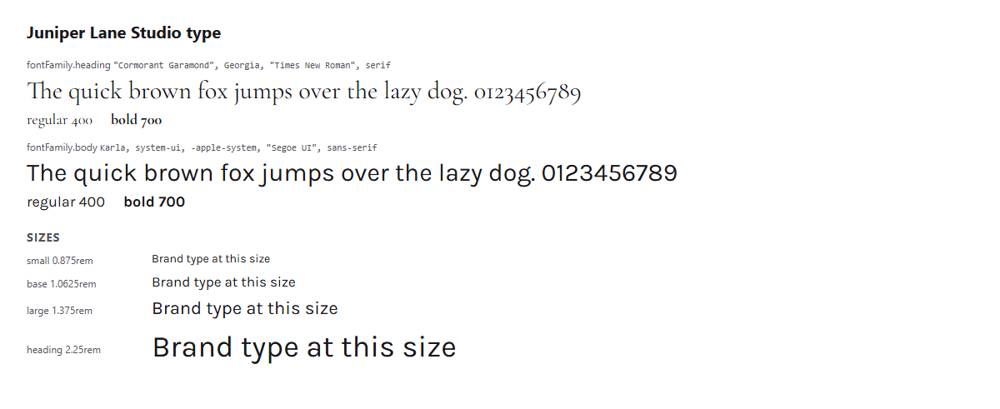

# Juniper Lane Studio brand kit (solo business example)


Juniper Lane Studio is a **fictional** one-person photography and design studio
that works with small businesses. This kit shows that OBKS works for a business
of one: a small, practical kit that takes an afternoon to fill in.

## About me

I photograph and design for small businesses: bakeries, salons, makers, and the
shops on your favorite street. I work with a handful of clients at a time, so
you always talk to me. (The full bio and services are in `copy/messaging.md`.)

## What this example demonstrates

- **A solo business:** the voice is "I", not "we", and the security checklist is
  sized for one person (MFA, one invoicing tool, no payment changes by email,
  watching for fake profiles).
- **Optional layers turned off:** `profiles.identity` is `false`, so there is no
  `identity/` folder. The short "about me" lives here and in `copy/messaging.md`.
- **No dark theme:** there is no `tokens/themes/` folder. Themes are optional.
- **Partner sharing with printers and clients:** visibility is `partner`. Run
  `obks publish --dry-run` to see exactly what a printer gets: the logo files,
  the brand-at-a-glance page, the CSS color variables, and the logo rules.
  Proposals, invoice designs, and pricing stay private.

## Start here

- **See the brand:** open [`tokens/exports/html/brand-at-a-glance.html`](tokens/exports/html/brand-at-a-glance.html) in a browser.
- **AI assistants:** start with [`AGENTS.md`](AGENTS.md).
- **Protect the brand:** [`security/brand-protection.md`](security/brand-protection.md).

## What lives where

| What | File |
|------|------|
| Settings (name, sharing, contrast pairs) | `brandkit.yaml` |
| How I sound | `voice/tone.md`, `voice/vocabulary.md`, `voice/style.md` |
| Word rules | `voice/terms.yaml` (checked by `obks check-copy`) |
| Bio, services, and image licensing | `copy/messaging.md`, `copy/legal.md` |
| Colors, fonts, logo rules | `visual/` |
| Logos | `assets/logo/` (monogram, reversed, wordmark, favicon) |
| Official values | `tokens/colors.obks.json`, `tokens/typography.obks.json` |
| Generated files | `tokens/exports/` (do not edit) |
| Brand protection checklist | `security/brand-protection.md` |

## Commands

```bash
obks export --all
obks digest
obks preview
obks validate --strict
obks publish --dry-run
```

## The brand in use

<!-- obks:previews -->
<!-- Generated by obks export from tokens/ and brandkit.yaml. Edit that, not this block. -->



<!-- /obks:previews -->
