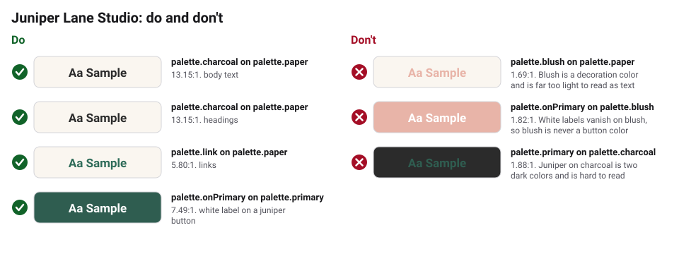
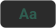

# Accessibility

Clients and their customers should be able to read everything I make,
on a phone in the sun or on a printed menu in a dim restaurant.

- Meet WCAG 2.2 AA: text needs a 4.5:1 contrast ratio with its background
  (3:1 for large text and buttons). Every pair below passes 4.5:1.
- `obks validate` checks every pair listed under `validation.contrastPairs` in
  `brandkit.yaml`. Add a pair whenever text goes on a new color.
- `blush` is decoration only. It never carries text, and white text never sits
  on it.
- Underline links in body text so they do not rely on color alone.
- Every photo on the website gets alt text that says what is in it
  ("A baker pulling sourdough loaves from the oven"), not "image1.jpg".
- Text on top of a photo needs a solid `charcoal` or `primary` band behind it,
  never just the photo.

## Checked text and background pairs

<!-- obks:contrast -->
<!-- Generated by obks export from tokens/ and brandkit.yaml. Edit that, not this block. -->

| Sample | Text | Background | Theme | Use | Contrast | Needs | Result |
|---|---|---|---|---|---|---|---|
|  | `palette.charcoal` | `palette.paper` | base | body text | 13.15:1 | 4.5:1 | Pass |
|  | `palette.charcoal` | `palette.paper` | base | headings | 13.15:1 | 4.5:1 | Pass |
|  | `palette.link` | `palette.paper` | base | links | 5.80:1 | 4.5:1 | Pass |
|  | `palette.onPrimary` | `palette.primary` | base | white label on a juniper button | 7.49:1 | 4.5:1 | Pass |
|  | `palette.charcoal` | `palette.wash` | base | text on a card | 12.06:1 | 4.5:1 | Pass |
|  | `palette.link` | `palette.wash` | base | links on a card | 5.32:1 | 4.5:1 | Pass |
|  | `palette.charcoal` | `palette.white` | base | body text on white (print and forms) | 14.15:1 | 4.5:1 | Pass |

**Avoid**

| Sample | Text | Background | Contrast | Why to avoid |
|---|---|---|---|---|
|  | `palette.blush` | `palette.paper` | 1.69:1 | Blush is a decoration color and is far too light to read as text |
|  | `palette.onPrimary` | `palette.blush` | 1.82:1 | White labels vanish on blush, so blush is never a button color |
|  | `palette.primary` | `palette.charcoal` | 1.88:1 | Juniper on charcoal is two dark colors and is hard to read |
<!-- /obks:contrast -->
