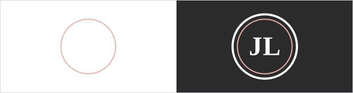
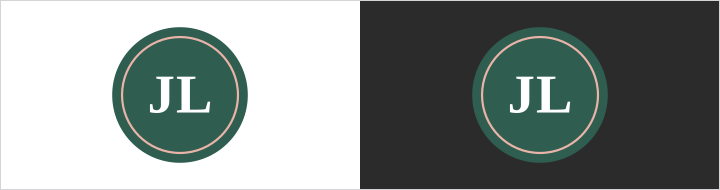
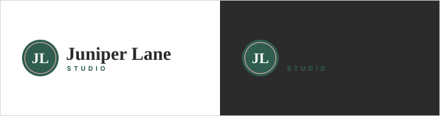

# Logo

This page is shared with printers, vendors, and clients.

| File | Use |
|------|-----|
| `assets/logo/mark.svg` | Default JL monogram, full color on light backgrounds |
| `assets/logo/mark-reversed.svg` | White outline version for dark backgrounds and photos |
| `assets/logo/wordmark.svg` | Monogram plus name, for website headers, business cards, and letterhead |
| `assets/logo/favicon.svg` | Browser tabs and small social profile images |

## Clear space

Leave empty space around the logo equal to at least a quarter of the monogram's
width. Nothing else (text, edges, other logos) goes inside that space.

## Minimum size

- Monogram: 32px on screen, 0.5 inch in print
- Wordmark: 160px wide on screen, 1.5 inches wide in print

## Colorways

- Default: full-color monogram or wordmark on `paper` or `white`
- On dark backgrounds or photos: the reversed monogram on `charcoal` or `primary`
- One-color printing (stamps, foil, engraving): the monogram in juniper green
  (`primary`) or solid black

## Notes for printers

- Match the hex values on the brand-at-a-glance page; ask for a proof on the
  chosen paper before a full run, because juniper green shifts on uncoated stock.
- The SVG files are vector and scale to any size. Ask for a PDF or EPS version
  if your workflow needs one.
- The fonts are Cormorant Garamond and Karla (free on Google Fonts). If you
  prefer, ask for a version with the text converted to outlines.

## Do not

- Stretch, rotate, outline, or add shadows
- Change the colors or swap the font in the wordmark
- Put the full-color monogram on busy photos; use the reversed version
- Put the logo on `blush`

## Logo files

<!-- obks:logos -->
<!-- Generated by obks export from tokens/ and brandkit.yaml. Edit that, not this block. -->
 `assets/logo/favicon.svg`  
 `assets/logo/mark-reversed.svg`  
 `assets/logo/mark.svg`  
 `assets/logo/wordmark.svg`
<!-- /obks:logos -->
