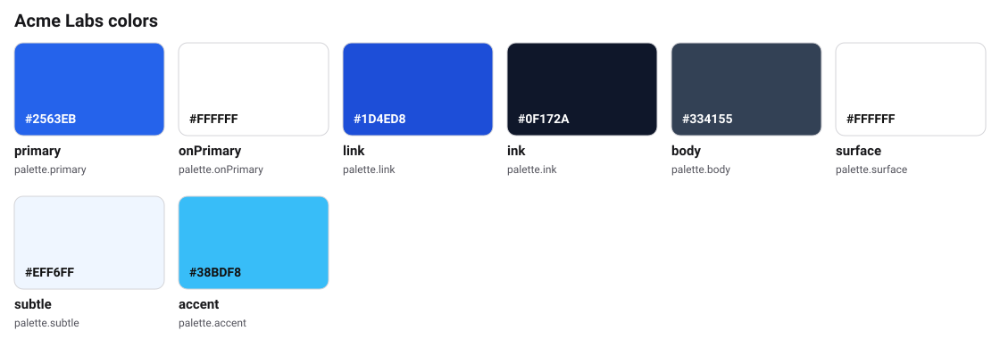
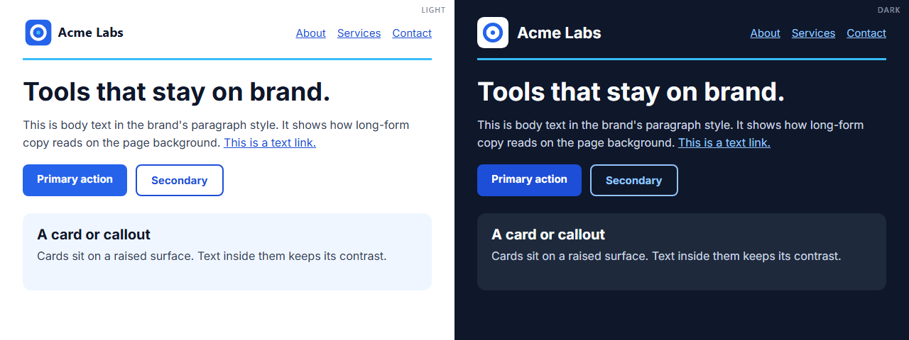
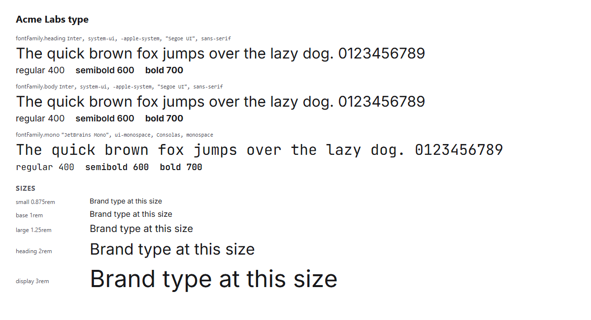

# Acme Labs brand kit (reference example)



Acme Labs is a **fictional** organization. This kit is the complete reference
for OBKS 0.2: every profile, a dark theme, typography, spacing, contrast checks,
a full logo set, and partner sharing.

## Start here

- **See the brand:** open [`tokens/exports/html/brand-at-a-glance.html`](tokens/exports/html/brand-at-a-glance.html) in a browser.
- **AI agents:** start with [`AGENTS.md`](AGENTS.md).
- **Sharing:** `partner`. Run `obks publish --dry-run` to see exactly what partners get.

## What lives where

| What | File |
|------|------|
| Settings (name, sharing, contacts, contrast pairs) | `brandkit.yaml` |
| Who we are | `identity/about.md`, `identity/naming.md`, `identity/mission.md` |
| What we offer, who we talk to, approved facts | `identity/offerings.md`, `identity/audiences.md`, `identity/facts.md` |
| How we sound | `voice/tone.md`, `voice/vocabulary.md`, `voice/style.md` |
| Word rules and sensitive topics | `voice/terms.yaml` (checked by `obks check-copy`), `voice/topics.md` |
| Approved wording, legal, and claims | `copy/messaging.md`, `copy/legal.md`, `copy/claims.md` |
| Colors, type, logo rules | `visual/` |
| Logos | `assets/logo/` (mark, mono, reversed, wordmark, favicon) |
| Official values | `tokens/colors.obks.json`, `tokens/typography.obks.json`, `tokens/spacing.obks.json`, `tokens/themes/dark.obks.json` |
| Generated files | `tokens/exports/` (CSS, DTCG, Tailwind v3 and v4, HTML page, agent brief) |
| Brand protection checklist | `security/brand-protection.md` |

## Commands

```bash
obks export --all
obks digest
obks validate --strict
obks publish --dry-run
```

## The brand in use

<!-- obks:previews -->
<!-- Generated by obks export from tokens/ and brandkit.yaml. Edit that, not this block. -->



<!-- /obks:previews -->
