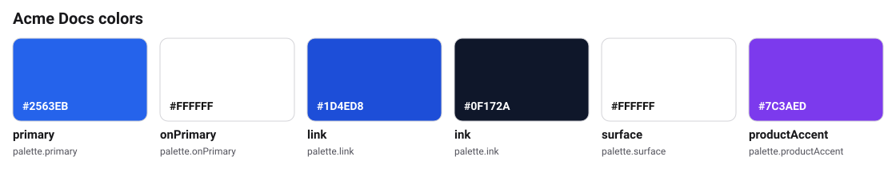
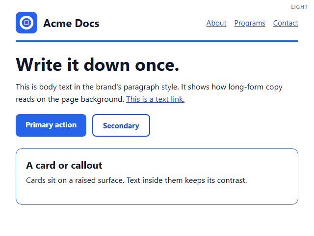

# Acme Docs brand kit (reference product example)



Acme Docs is a **fictional** product of the fictional
[Acme Labs](../starter-org/) organization. This kit shows how a child kit
inherits the parent palette and adds only what is different.

- Colors marked `inheritsFrom` must match `../starter-org` exactly.
  `obks validate` checks them because `hierarchy.parent.path` points there.
- The only new color is `productAccent`.
- Sharing is `private` (the default): nothing leaves the organization.

## Commands

```bash
obks export --all
obks digest
obks validate --strict
```

In a separate repository, check out the parent kit and pass it explicitly:

```bash
obks validate --strict --parent ../acme-labs-brand-kit
```

## The brand in use

<!-- obks:previews -->
<!-- Generated by obks export from tokens/ and brandkit.yaml. Edit that, not this block. -->

<!-- /obks:previews -->
