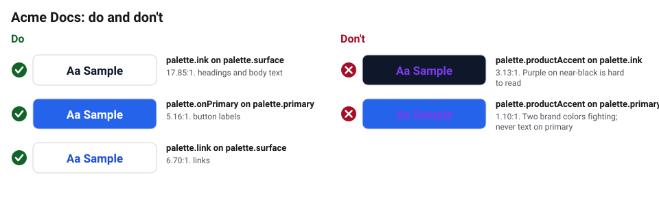

# Accessibility

- Meet WCAG 2.2 AA: text needs a 4.5:1 contrast ratio with its background
  (3:1 for large text and buttons).
- `bkr validate` checks every color pair listed in `brandkit.yaml` under
  `validation.contrastPairs`. Add a pair whenever you put text on a new color.
- Do not use color alone to show meaning (add an icon or a word).
- Give every image meaningful alt text.

## Checked text and background pairs

<!-- bkr:contrast -->
<!-- Generated by bkr export from tokens/ and brandkit.yaml. Edit those, not this block. -->

| Sample | Text | Background | Theme | Use | Contrast | Needs | Result |
|---|---|---|---|---|---|---|---|
|  | `palette.ink` | `palette.surface` | base | headings and body text | 17.85:1 | 4.5:1 | Pass |
|  | `palette.onPrimary` | `palette.primary` | base | button labels | 5.16:1 | 4.5:1 | Pass |
|  | `palette.link` | `palette.surface` | base | links | 6.70:1 | 4.5:1 | Pass |

**Avoid**

| Sample | Text | Background | Contrast | Why to avoid |
|---|---|---|---|---|
|  | `palette.productAccent` | `palette.ink` | 3.13:1 | Purple on near-black is hard to read |
|  | `palette.productAccent` | `palette.primary` | 1.10:1 | Two brand colors fighting; never text on primary |
<!-- /bkr:contrast -->
